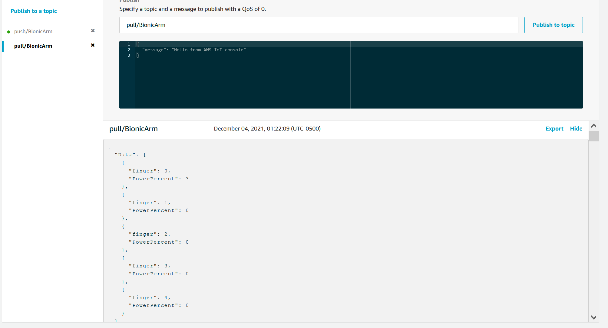
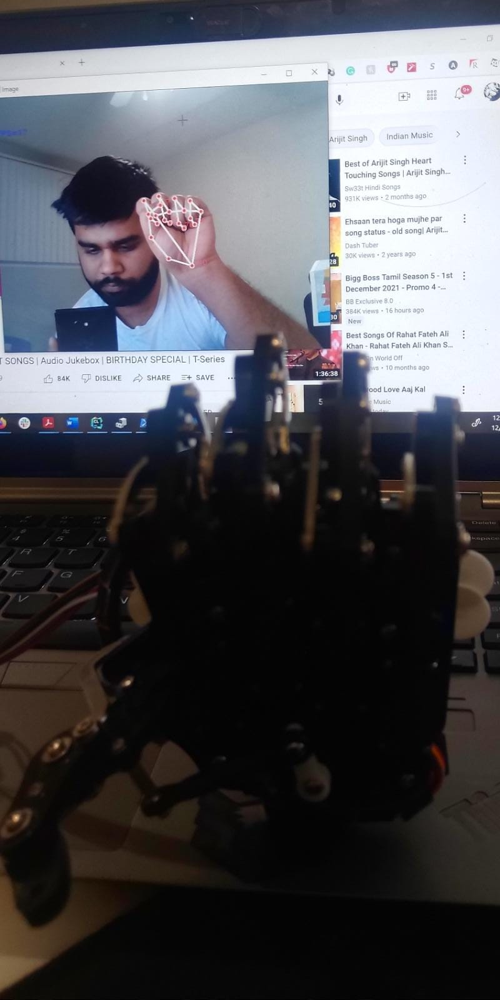

# Vision-Controlled Robotic Hand with ESP32 and AWS IoT | IoT Hand Gesture Recognition

[](https://youtu.be/dBysV4OpSVE)
[](https://aws.amazon.com/iot-core/)
[](https://docs.espressif.com/projects/esp-idf/)

> **Build a wireless gesture-controlled robotic hand using computer vision, ESP32, and cloud IoT**
> Perfect for robotics projects, IoT learning, prosthetics research, and embedded systems portfolios

## Overview

A complete **Internet of Things (IoT) project** that demonstrates **real-time gesture control of a 5-finger robotic hand from anywhere in the world**. This embedded systems project combines **Python computer vision** (MediaPipe hand tracking), **ESP32 microcontroller programming** with FreeRTOS, **AWS IoT Core MQTT messaging**, and **servo motor control** via I2C communication. Ideal for **university capstone projects**, **robotics competitions**, **final year engineering projects**, and learning **wireless IoT architecture**.

The system uses **machine vision** to detect hand movements through your webcam, processes gesture data in real-time, and transmits control commands through **AWS cloud infrastructure** using secure MQTT protocol (Message Queue Telemetry Transport). The ESP32 embedded device receives commands and precisely controls **PCA9685 PWM servo driver** to actuate a mechanical hand, creating a **telepresence robotic system** with global reach.

### What You'll Build & Learn

- **Global Wireless Control**: Operate the robotic hand remotely from anywhere with internet connectivity via AWS IoT Core
- **Real-Time Computer Vision**: Implement MediaPipe hand tracking with 21 3D landmarks at 30+ FPS for gesture recognition
- **Secure IoT Communication**: TLS 1.2 encrypted MQTT protocol with X.509 certificate authentication
- **Low Latency Control**: Achieve sub-200ms end-to-end latency from gesture detection to servo motor actuation
- **Embedded Systems Programming**: FreeRTOS-based multitasking on ESP32 dual-core microcontroller (Arduino alternative)
- **Hardware Interfacing**: Build custom I2C drivers for PCA9685 16-channel PWM servo controller (Raspberry Pi compatible)
- **Cloud IoT Architecture**: Design scalable device fleet management with AWS IoT Device SDK
- **Prosthetics & HCI Research**: Foundation for assistive technology and human-robot interaction studies

### Technologies & Skills Covered

**Embedded Systems**: ESP32, ESP-IDF, FreeRTOS, I2C protocol, PWM control, hardware debugging
**Computer Vision**: Python, OpenCV, MediaPipe, hand landmark detection, gesture recognition
**Cloud IoT**: AWS IoT Core, MQTT messaging, Thing shadows, device provisioning, TLS/SSL
**Programming**: C for embedded systems, Python for AI/ML, JSON parsing, real-time communication
**Electronics**: Servo motors, PWM drivers (PCA9685), microcontroller pinout, circuit design

### Real-World Applications & Industry Use Cases

This gesture control technology is applicable to:
- **Remote Surgery & Telemedicine**: Surgeons performing procedures remotely with robotic hands
- **Hazardous Environment Operations**: Nuclear facilities, bomb disposal, underwater exploration
- **Manufacturing & Industry 4.0**: Training operators for complex assembly without physical robots
- **Assistive Technology**: Helping people with disabilities control robotic prosthetics
- **Space Exploration**: Controlling robotic arms on rovers from mission control
- **Entertainment & Gaming**: VR games, motion capture, immersive experiences
- **Education & Training**: Teaching robotics concepts, STEM workshops, online courses
- **Research Labs**: Testbed for HCI research, telepresence studies, ML experiments

---

## System Architecture

### High-Level Data Flow

```
┌─────────────────┐         ┌──────────────────┐         ┌─────────────────┐
│   Webcam        │         │   AWS IoT Core   │         │   ESP32 + Hand  │
│                 │         │   MQTT Broker    │         │                 │
│  MediaPipe      │  MQTT   │                  │  MQTT   │   PCA9685 PWM   │
│  Hand Tracking  │ ──────> │  TLS Encrypted   │ ──────> │   5x Servos     │
│                 │ Publish │  Global Cloud    │Subscribe│                 │
│  Python Script  │         │                  │         │   Bionic Hand   │
└─────────────────┘         └──────────────────┘         └─────────────────┘

    Local Device           Cloud Infrastructure           Edge Device
  (Your Computer)          (AWS us-east-2)            (Bionic Hand Location)
```

### Component Breakdown

#### 1. Vision Processing Layer (`HandRecognition.py`)
- **MediaPipe Hands**: Detects 21 3D hand landmarks in real-time
- **Gesture Analysis**: Calculates Euclidean distance from fingertips (landmarks 4, 8, 12, 16, 20) to wrist base (landmark 0)
- **Normalization**: Maps physical distances to 0-100% power range for servo control
- **MQTT Publishing**: Transmits JSON payloads to AWS IoT topic `pull/BionicArm` via boto3 client

#### 2. Cloud Communication Layer (AWS IoT Core)
- **MQTT Broker**: Handles pub/sub messaging between vision client and ESP32
- **TLS Security**: X.509 certificate authentication + AES-256 encryption
- **Topic Structure**:
  - `pull/BionicArm` - Vision script publishes finger positions
  - `push/BionicArm` - ESP32 publishes status updates (configurable)
- **Thing Registry**: Each bionic hand registered as unique IoT Thing with device shadow

#### 3. Embedded Control Layer (ESP32 Firmware)
- **AWS_MQTT.c**: MQTT client using AWS IoT Device SDK for Embedded C
  - WiFi connection management with auto-reconnect
  - TLS handshake with embedded certificates
  - JSON parsing using Frozen library for lightweight parsing
  - FreeRTOS queue-based message passing to driver layer

- **Drivers.c**: Hardware abstraction layer
  - Custom I2C driver for PCA9685 16-channel PWM controller
  - Converts power percentage (0-100%) to 12-bit PWM values (409-1693)
  - Individual finger control mapping (Thumb, Index, Middle, Ring, Pinky)
  - Non-blocking actuation via FreeRTOS queues

- **main.c**: Application entry point
  - Creates concurrent FreeRTOS tasks on dual-core ESP32
  - Task management and system initialization

---

## Hardware Components (Bill of Materials for IoT Robotics Project)

| Component | Specification | Purpose | Alternative Options |
|-----------|--------------|---------|---------------------|
| **ESP32 DevKit** | Dual-core Xtensa LX6, WiFi/BT | Main microcontroller, AWS IoT client | NodeMCU ESP8266, Arduino + WiFi shield |
| **PCA9685** | 16-channel 12-bit PWM driver | Generates precise PWM signals for servos | Adafruit PWM Servo Driver board |
| **Servo Motors** | 5x SG90 or MG90S (180°) | Actuates individual fingers | TowerPro MG996R for stronger grip |
| **Power Supply** | 5V 3A+ external adapter | Powers servos (ESP32 can be USB-powered) | Battery pack with voltage regulator |
| **I2C Wiring** | SDA: GPIO23, SCL: GPIO22 | Communication bus to PCA9685 | Breadboard jumper wires |
| **Robotic Hand** | 3D printed or commercial | Physical hand mechanism with tendon system | InMoov hand, OpenBionics, or custom design |

**Total Estimated Cost**: $30-$60 USD (excluding 3D printed hand)
**Compatible Platforms**: Arduino IDE, PlatformIO, Raspberry Pi (with modifications)

### Circuit Connections

```
ESP32                 PCA9685               Servos
┌─────────┐         ┌─────────┐         ┌──────────┐
│ GPIO 23 ├────────>│ SDA     │         │ Thumb    │
│ GPIO 22 ├────────>│ SCL     │         │ Index    │
│   GND   ├────────>│ GND     │         │ Middle   │
│   3.3V  ├────────>│ VCC     │         │ Ring     │
└─────────┘         │         ├────────>│ Pinky    │
                    │ V+      │<─── 5V  │          │
                    │ PWM 0-5 │         └──────────┘
                    └─────────┘
```

---

## Software Architecture Details

### Message Protocol

**Published by Vision Client** (`pull/BionicArm`):
```json
{
  "Data": [
    {"finger": 0, "PowerPercent": 45},  // Thumb
    {"finger": 1, "PowerPercent": 78},  // Index
    {"finger": 2, "PowerPercent": 12},  // Middle
    {"finger": 3, "PowerPercent": 89},  // Ring
    {"finger": 4, "PowerPercent": 34}   // Pinky
  ]
}
```

**Message Flow**:
1. MediaPipe detects hand landmarks (30+ times/second)
2. Python calculates finger extension percentage based on distance formula:
   ```python
   distance = 100 - sqrt((x_tip - x_wrist)² + (y_tip - y_wrist)² + (z_tip - z_wrist)²) × 100 / 300
   ```
3. Publishes JSON every 500ms (configurable via `Payloadpushtime`)
4. AWS IoT Core routes message to subscribed ESP32
5. ESP32 parses JSON using Frozen library (lightweight, zero-allocation)
6. Queues commands to I2C task via FreeRTOS `xFingerPowerQueue`
7. I2C task converts percentage to PWM: `PWM = 409 + (Percent × 1693 / 100)`
8. PCA9685 generates PWM signal for corresponding servo channel

### ESP32 Firmware Components

#### FreeRTOS Task Architecture
```c
Core 0:                      Core 1:
┌─────────────────┐         ┌──────────────────┐
│  I2C Task       │         │  AWS IoT Task    │
│  (Priority 0)   │<────────│  (Priority 0)    │
│                 │  Queue  │                  │
│  - PCA9685 Init │         │  - WiFi Connect  │
│  - Read Queue   │         │  - MQTT Connect  │
│  - Write PWM    │         │  - Subscribe     │
│  - Servo Control│         │  - Parse JSON    │
└─────────────────┘         └──────────────────┘
```

#### Configuration Management (`Kconfig.projbuild`)
All sensitive credentials and endpoints are configured via ESP-IDF's `menuconfig` system:
- **WiFi Credentials**: SSID and password (deprecated in this repo - for reference only)
- **AWS IoT Endpoint**: Thing-specific MQTT host (e.g., `abc123.iot.us-east-2.amazonaws.com`)
- **MQTT Topics**: Configurable publish/subscribe topics
- **Certificate Source**: Embedded in firmware or loaded from SD card

#### Security Implementation
- **X.509 Certificates**: Device certificate, private key, and root CA embedded at compile-time
- **TLS 1.2**: mbedTLS library handles encrypted communication
- **Certificate Validation**: Hostname verification enabled to prevent MITM attacks
- **Unique Thing Identity**: Each device has unique client ID and certificate pair

---

## Project Structure

```
VisionControlledBionicHand/
├── HandRecognition.py           # Python vision client with MediaPipe
├── main/
│   ├── main.c                   # ESP32 entry point, task creation
│   ├── AWS_MQTT.c               # AWS IoT MQTT client implementation
│   ├── AWS_MQTT.h               # MQTT public interface
│   ├── Drivers.c                # PCA9685 I2C driver, servo control
│   ├── Drivers.h                # Hardware driver interface
│   ├── Kconfig.projbuild        # Configuration menu definitions
│   ├── CMakeLists.txt           # Build system component definition
│   ├── certs/                   # TLS certificates (DEPRECATED - for reference)
│   │   ├── aws-root-ca.pem      # Amazon Root CA 1
│   │   ├── certificate.pem.crt  # Device certificate
│   │   └── private.pem.key      # Device private key
│   └── frozen/                  # Frozen JSON parser library (submodule)
│       └── frozen.c             # Lightweight JSON parser
├── components/
│   └── esp-aws-iot/             # AWS IoT Device SDK for Embedded C
│       └── aws-iot-device-sdk-embedded-C/
├── images/
│   ├── AwsTest.png              # AWS IoT Core MQTT test client screenshot
│   └── Demo.jpeg                # Bionic hand in action
├── CMakeLists.txt               # Project-level build configuration
├── Makefile                     # Legacy build system support
└── README.md                    # This file
```

---

## Setup Instructions

### Prerequisites

#### For Vision Client (Python)
- Python 3.8+
- Webcam or camera device
- AWS account with IoT Core access

#### For ESP32 Firmware
- [ESP-IDF v4.x or later](https://docs.espressif.com/projects/esp-idf/en/latest/esp32/get-started/)
- ESP32 development board
- USB cable for programming
- Hardware components listed above

---

### 1. AWS IoT Core Configuration

#### Step 1.1: Create IoT Thing
1. Navigate to [AWS IoT Core Console](https://console.aws.amazon.com/iot/)
2. Go to **Manage → Things → Create Things**
3. Create a single thing named `BionicArm` (or custom name)
4. Choose **Auto-generate certificates**
5. Download:
   - Device certificate (`xxx-certificate.pem.crt`)
   - Private key (`xxx-private.pem.key`)
   - Amazon Root CA 1 (`AmazonRootCA1.pem`)
6. **Activate certificate** before closing the dialog

#### Step 1.2: Create IoT Policy
```json
{
  "Version": "2012-10-17",
  "Statement": [
    {
      "Effect": "Allow",
      "Action": "iot:Connect",
      "Resource": "arn:aws:iot:us-east-2:ACCOUNT_ID:client/BionicArm"
    },
    {
      "Effect": "Allow",
      "Action": "iot:Subscribe",
      "Resource": "arn:aws:iot:us-east-2:ACCOUNT_ID:topicfilter/pull/*"
    },
    {
      "Effect": "Allow",
      "Action": "iot:Receive",
      "Resource": "arn:aws:iot:us-east-2:ACCOUNT_ID:topic/pull/*"
    },
    {
      "Effect": "Allow",
      "Action": "iot:Publish",
      "Resource": "arn:aws:iot:us-east-2:ACCOUNT_ID:topic/push/*"
    }
  ]
}
```
Attach this policy to your certificate.

#### Step 1.3: Note Your Endpoint
1. Go to **Settings** in AWS IoT Console
2. Copy your **Device data endpoint** (e.g., `abc123xyz.iot.us-east-2.amazonaws.com`)
3. This will be used in both Python and ESP32 configuration

---

### 2. Python Vision Client Setup

#### Step 2.1: Install Dependencies
```bash
pip install opencv-python mediapipe boto3
```

#### Step 2.2: Configure AWS Credentials
**Option A: AWS Credentials File (Recommended)**
```bash
# Configure AWS CLI with your IAM user credentials
aws configure
# Enter: Access Key ID, Secret Access Key, region (us-east-2), output format (json)
```

**Option B: Modify HandRecognition.py (Not Recommended)**
```python
# Line 8: Replace with your IAM credentials (temporary for testing only)
client = boto3.client('iot-data',
    aws_access_key_id='YOUR_ACCESS_KEY',
    aws_secret_access_key='YOUR_SECRET_KEY',
    region_name='us-east-2'  # Match your IoT Core region
)
```

**Important**: The credentials in this repository are **DEPRECATED and invalid**. Use your own AWS IAM credentials with IoT publish permissions.

#### Step 2.3: Configure MQTT Topic
```python
# Line 9: Set your thing name
destination = 'pull/BionicArm'  # Format: pull/<YOUR_THING_NAME>
```

#### Step 2.4: Run Vision Client
```bash
python HandRecognition.py
```
A window will open showing your hand tracking. Move your hand in view of the camera.

---

### 3. ESP32 Firmware Setup

#### Step 3.1: Install ESP-IDF
Follow the [official ESP-IDF installation guide](https://docs.espressif.com/projects/esp-idf/en/latest/esp32/get-started/):
```bash
# Linux/macOS example
git clone --recursive https://github.com/espressif/esp-idf.git
cd esp-idf
./install.sh
. ./export.sh
```

#### Step 3.2: Clone This Repository
```bash
git clone <repository-url>
cd VisionControlledBionicHand
git submodule update --init --recursive  # Initialize AWS SDK submodule
```

#### Step 3.3: Install Certificates
Replace the placeholder certificates with your downloaded AWS certificates:
```bash
# Copy your certificates to main/certs/
cp ~/Downloads/abc123-certificate.pem.crt main/certs/certificate.pem.crt
cp ~/Downloads/abc123-private.pem.key main/certs/private.pem.key
cp ~/Downloads/AmazonRootCA1.pem main/certs/aws-root-ca.pem
```

#### Step 3.4: Configure Project
```bash
idf.py menuconfig
```

Navigate through the menu and configure:

**BionicArm Configuration:**
- WiFi SSID: `<Your WiFi Network Name>`
- WiFi Password: `<Your WiFi Password>`
- AWS IoT MQTT Host: `<Your AWS IoT Endpoint>` (from Step 1.3)
- AWS IoT MQTT Port: `8883` (default)
- AWS IoT Client ID: `BionicArm` (must match your Thing name)
- AWS Topic SUB: `pull/BionicArm` (topic ESP32 subscribes to)
- AWS Topic PUB: `push/BionicArm` (topic ESP32 publishes to)
- Certificate Source: `Embed into app` (default)

Save and exit (press `S` then `Q`).

#### Step 3.5: Build and Flash
```bash
# Build the firmware
idf.py build

# Flash to ESP32 (automatically detects USB port)
idf.py flash

# Monitor serial output (optional, useful for debugging)
idf.py monitor
```

**Expected Serial Output:**
```
I (1234) subpub: AWS IoT SDK Version 3.0.1
I (1456) subpub: Setting WiFi configuration SSID YourSSID...
I (2345) wifi:connected with YourSSID
I (2678) subpub: Connecting to AWS...
I (3456) subpub: Subscribing...
```

---

### 4. Hardware Assembly

#### Step 4.1: Wire PCA9685 to ESP32
| ESP32 Pin | PCA9685 Pin | Notes |
|-----------|-------------|-------|
| GPIO 23   | SDA         | I2C Data line |
| GPIO 22   | SCL         | I2C Clock line |
| GND       | GND         | Common ground |
| 3.3V      | VCC         | PCA9685 logic power |

#### Step 4.2: Connect Servos to PCA9685
| Finger | PCA9685 Channel | Servo Color Code |
|--------|----------------|------------------|
| Thumb  | PWM 0          | Brown=GND, Red=V+, Orange=Signal |
| Index  | PWM 1          | (same) |
| Middle | PWM 2          | (same) |
| Ring   | PWM 3          | (same) |
| Pinky  | PWM 4          | (same) |

#### Step 4.3: Power Servos
- Connect external 5V 3A power supply to PCA9685 **V+** and **GND**
- **Critical**: Share common ground between ESP32, PCA9685, and servo power supply
- Do NOT power servos from ESP32's 5V pin (insufficient current)

---

## Usage

### Running the System

1. **Power on ESP32**: Connect to computer or external 5V supply
2. **Wait for WiFi connection**: Check serial monitor for "Connecting to AWS..."
3. **Start Python client**:
   ```bash
   python HandRecognition.py
   ```
4. **Control the hand**: Move your hand in front of the camera
   - Closed fist → All fingers close
   - Open hand → All fingers extend
   - Individual finger movements are tracked and replicated

### Verification

#### Test in AWS IoT Console
1. Go to **Test → MQTT test client**
2. Subscribe to `#` (all topics)
3. Run Python script and verify messages appearing on `pull/BionicArm` topic



#### Check ESP32 Serial Output
```bash
idf.py monitor
```
You should see finger position messages:
```
Subscribe callback
pull/BionicArm	{"Data":[{"finger":0,"PowerPercent":45},...]}
{finger: 0,PowerPercent: 45}
THUMB
REG VAL ON 00 01 OFF 05 99
```

---

## System Performance

| Metric | Value | Notes |
|--------|-------|-------|
| **Hand Detection FPS** | 30-60 FPS | Depends on computer GPU/CPU |
| **MQTT Publish Rate** | 2 Hz (500ms) | Configurable in `HandRecognition.py` |
| **End-to-End Latency** | 150-300ms | Vision → AWS → ESP32 → Servo |
| **WiFi Range** | 50-100m | Depends on router and environment |
| **Global Range** | Unlimited | Via AWS IoT Core cloud infrastructure |
| **Servo Resolution** | 12-bit (4096 steps) | PCA9685 PWM resolution |
| **Power Consumption** | ~2W (ESP32) + ~15W (5 servos) | Varies with servo load |

---

## Global Wireless Control Explained

### How Cross-Globe Communication Works

1. **Vision Client** (e.g., in New York):
   - Captures hand gestures via webcam
   - Publishes to AWS IoT Core endpoint in `us-east-2` (Ohio)
   - Uses MQTT over TLS on port 8883

2. **AWS IoT Core** (cloud infrastructure):
   - Receives message and routes to all subscribers on `pull/BionicArm` topic
   - Handles connection from ESP32 regardless of geographic location
   - Maintains persistent MQTT connections with auto-reconnect

3. **ESP32** (e.g., in Tokyo):
   - Maintains persistent MQTT connection to AWS IoT Core
   - Receives messages as soon as they're published
   - No port forwarding, VPN, or public IP required
   - Works behind NAT/firewalls (outbound MQTT connection)

**Key Advantages:**
- **No Direct Network Connection**: Vision client and ESP32 never communicate directly
- **Firewall Friendly**: ESP32 initiates outbound connection (no inbound ports needed)
- **Scalable**: Can control multiple bionic hands by creating multiple Things
- **Reliable**: AWS handles connection drops, message queuing, and retries
- **Secure**: TLS encryption + certificate auth prevents unauthorized access

---

## Code Deep Dive

### Python: Hand Tracking Algorithm

```python
# MediaPipe detects 21 landmarks per hand in 3D space
# Landmark 0: Wrist base
# Landmarks 4, 8, 12, 16, 20: Fingertips

for id, lndmrk in enumerate(EachHandLandmark.landmark):
    if id % 4 == 0:  # Process only tip and base landmarks
        # Convert normalized coordinates to pixel space
        xcoordinate = int(lndmrk.x * width)
        ycoordinate = int(lndmrk.y * height)
        zcoordinate = lndmrk.z

        if id == 0:  # Save wrist position as reference
            xZero, yZero, zZero = xcoordinate, ycoordinate, zcoordinate

        # Calculate 3D Euclidean distance from wrist to current landmark
        distance = 100 - pow(
            pow(xcoordinate - xZero, 2) +
            pow(ycoordinate - yZero, 2) +
            pow(zcoordinate - zZero, 2),
            1/2
        ) * 100 / 300

        # Clamp to 0-100 range
        distance = max(0, min(100, distance))

        # Map landmark ID to finger
        if id == 4: PowerPercentThumb = distance
        # ... (similar for other fingers)
```

### ESP32: JSON Parsing with Frozen

```c
// Callback when MQTT message received on subscribed topic
void iot_subscribe_callback_handler(AWS_IoT_Client *pClient, char *topicName,
                                     uint16_t topicNameLen, IoT_Publish_Message_Params *params) {

    // Parse JSON array using Frozen library (zero-allocation)
    for (i = 0; json_scanf_array_elem((char *)params->payload, len, ".Data", i, &t) > 0; i++) {
        // Extract finger index and power percentage
        json_scanf(t.ptr, t.len, "{finger: %d,PowerPercent: %d}",
                   &GetFinger, &GetPowerPercent);

        // Queue command to I2C driver task
        SendTaskQueue.Finger = GetFinger;
        SendTaskQueue.PowerPercent = GetPowerPercent;
        xQueueSend(xFingerPowerQueue, (void *)&SendTaskQueue, 0);
    }
}
```

### ESP32: PWM Conversion Algorithm

```c
// PCA9685 uses 12-bit PWM (0-4095)
// Servo pulse width: 1ms (409) to 2ms (1693) for 0-180° rotation

void ActuationTask(void) {
    FingerActivation CurrentTaskQueue;

    if (xQueueReceive(xFingerPowerQueue, &CurrentTaskQueue, 10) == pdPASS) {
        // Convert 0-100% to PWM analog value
        uint16_t Percent2Analog;

        // Thumb has inverted control (100% = closed, 0% = open)
        if (CurrentTaskQueue.Finger == Thumb) {
            Percent2Analog = MINServoAnalog +
                ((100 - CurrentTaskQueue.PowerPercent) * MAXServoAnalog / 100);
        } else {
            Percent2Analog = MINServoAnalog +
                (CurrentTaskQueue.PowerPercent * MAXServoAnalog / 100);
        }

        // Write to PCA9685 channel registers via I2C
        i2c_master_write_slave(I2C_MASTER_NUM, ESP_SLAVE_ADDR,
                               reg_SERVO_x__OFF_L, &SERVO_x__OFF_L, 1);
        // ... (similar for other registers)
    }
}
```

---

## Troubleshooting Guide | Common Problems and Solutions

### How to Fix Python Computer Vision Issues

**Problem**: `boto3.exceptions.NoCredentialsError` when running hand tracking script
- **Solution**: Run `aws configure` and enter valid IAM credentials with IoT publish permissions
- **Related**: AWS CLI not configured, boto3 SDK authentication error

**Problem**: Camera not detected or OpenCV can't access webcam
- **Solution**: Check camera index in `cv2.VideoCapture(0)`, try changing `0` to `1` or `2`
- **Windows users**: May need to allow camera permissions in Privacy settings
- **Linux users**: Ensure user is in `video` group: `sudo usermod -a -G video $USER`

**Problem**: Hand not detected by MediaPipe gesture recognition
- **Solution**: Ensure good lighting, hand clearly visible, and palm facing camera
- **Tips**: Uniform background helps, avoid shadows, maintain 30-80cm distance from camera

**Problem**: Low FPS or laggy hand tracking performance
- **Solution**: Reduce MediaPipe `model_complexity` to 0, lower camera resolution, close other GPU-intensive apps
- **Hardware acceleration**: Enable GPU support for TensorFlow Lite

### How to Debug ESP32 Microcontroller Connection Problems

**Problem**: WiFi connection fails on ESP32
- **Solution**: Verify SSID/password in menuconfig, check 2.4GHz band support (ESP32 doesn't support 5GHz WiFi)
- **Common mistake**: Extra spaces in SSID/password, incorrect WiFi security type (use WPA2)
- **Enterprise WiFi**: May require certificate authentication (not covered in basic setup)

**Problem**: `aws_iot_mqtt_connect` returns error or timeout
- **Solution**:
  - Verify AWS IoT endpoint URL is correct (no typos in menuconfig)
  - Check certificates are valid and activated in AWS IoT Console
  - Ensure Thing name matches Client ID in menuconfig exactly
  - Test endpoint with `ping your-endpoint.iot.region.amazonaws.com`
- **Firewall issues**: Ensure port 8883 is not blocked by router/firewall

**Problem**: ESP32 connects to AWS IoT but doesn't receive MQTT messages
- **Solution**:
  - Verify subscription topic matches publish topic in Python script (case-sensitive)
  - Check AWS IoT policy allows `iot:Subscribe` and `iot:Receive` actions
  - Test with AWS IoT Test Client in console to confirm messages are being published
  - Monitor serial output: `idf.py monitor` to see received data

**Problem**: Servo motors jitter, vibrate, or don't move smoothly
- **Solution**:
  - Ensure adequate power supply (5V 3A minimum for 5 servos)
  - Check I2C wiring for loose connections or incorrect GPIO pins
  - Verify servo pulse width calibration in `Drivers.c` (MINServoAnalog/MAXServoAnalog values)
  - Add capacitor (1000µF) across servo power supply to reduce noise

### Hardware Integration Issues (I2C, PWM, Servo Control)

**Problem**: PCA9685 PWM driver not responding or I2C communication error
- **Solution**:
  - Check I2C address (default 0x40) using `i2cdetect` command
  - Verify pull-up resistors on SDA/SCL lines (may need external 4.7kΩ resistors)
  - Test with minimal example code to isolate hardware vs software issue
  - Ensure common ground between ESP32 and PCA9685

**Problem**: Servo motors move to wrong positions or inverted movement
- **Solution**: Calibrate servo range by adjusting `MINServoAnalog` (409) and `MAXServoAnalog` (1693) in `Drivers.c`
- **Individual calibration**: Each servo may have slightly different pulse width requirements (1-2ms standard)

**Problem**: ESP32 reboots randomly or brownout detector triggers
- **Solution**: Servos drawing too much current during movement - use external power supply, not ESP32 VIN pin
- **Add decoupling**: 100µF capacitor near ESP32 power pins

---

## Advanced Configuration

### Increasing Publish Rate
In `HandRecognition.py`, reduce the publish interval:
```python
Payloadpushtime = 0.1  # Publish every 100ms (10 Hz) instead of 500ms
```
**Note**: Higher rates increase AWS IoT costs and bandwidth usage.

### Supporting Multiple Hands
1. Create additional Things in AWS IoT Core (`BionicArm2`, `BionicArm3`, etc.)
2. Use unique topics: `pull/BionicArm2`, `push/BionicArm2`
3. Configure each ESP32 with its unique Client ID and topics
4. Run multiple Python scripts with different destination topics

### Adding Bi-Directional Communication
Uncomment lines in `AWS_MQTT.c` to publish status back to cloud:
```c
// Lines 317-323: Publish servo status
sprintf(cPayload, "{finger:%d,power:%d}", CurrentTaskQueue.Finger, CurrentTaskQueue.PowerPercent);
paramsQOS0.payloadLen = strlen(cPayload);
rc = aws_iot_mqtt_publish(&client, CONFIG_AWS_TOPIC_PUB,
                          strlen(CONFIG_AWS_TOPIC_PUB), &paramsQOS0);
```

### Custom Gesture Recognition
Extend `HandRecognition.py` with gesture classifiers:
- Detect pinch, peace sign, thumbs up, etc.
- Use landmark angles instead of just distances
- Train ML model for complex gesture recognition

---

## Production Deployment Considerations

### Security Best Practices
- **Never commit credentials**: Use AWS Secrets Manager or environment variables
- **Rotate certificates**: Set certificate expiration and auto-rotation policies
- **Principle of least privilege**: IoT policies should allow only necessary topics
- **Enable CloudWatch logging**: Monitor unauthorized access attempts

### Scalability
- **AWS IoT Core auto-scales** to millions of devices without code changes
- **Use IoT Rules** to route messages to Lambda, DynamoDB, etc. for processing
- **Device shadows** enable offline operation and state synchronization

### Monitoring
- **CloudWatch Metrics**: Track message rates, connection drops, errors
- **Fleet metrics**: Monitor all devices from centralized dashboard
- **Alerting**: Set up SNS notifications for device disconnections

### Cost Optimization
- AWS IoT Core charges per message and connection time
- Reduce publish rate when hand is static (delta detection)
- Use QoS 0 instead of QoS 1 for lower costs (already implemented)
- Estimated cost: $1-5/month per device under normal usage

---

## Demo

Watch the full system in action:

[](https://youtu.be/dBysV4OpSVE)

**Demo Video**: [https://youtu.be/dBysV4OpSVE](https://youtu.be/dBysV4OpSVE)

### Screenshots

**AWS IoT Core MQTT Test Client** - Real-time message monitoring:


**Bionic Hand In Action** - Hardware demonstration:



---

## Technical Specifications

### Software Stack
| Component | Technology | Version |
|-----------|-----------|---------|
| Vision Processing | Python + OpenCV | 4.x |
| Hand Tracking | Google MediaPipe | 0.10+ |
| Cloud Client | boto3 | 1.26+ |
| Embedded Framework | ESP-IDF | 4.x |
| RTOS | FreeRTOS | 10.x (included in ESP-IDF) |
| MQTT Client | AWS IoT Device SDK for Embedded C | 3.0.1 |
| TLS Stack | mbedTLS | 2.x |
| JSON Parser | Frozen | - |
| Build System | CMake | 3.5+ |

### Hardware Specifications
| Parameter | Value |
|-----------|-------|
| ESP32 Clock | 240 MHz dual-core |
| ESP32 Flash | 4MB |
| ESP32 RAM | 520 KB SRAM |
| I2C Frequency | 100 kHz |
| PCA9685 PWM Frequency | 50 Hz (servo standard) |
| Servo Pulse Width | 1-2ms (409-1693 in 12-bit) |
| Power Consumption | ~17W total system |

---

## Future Enhancements & Project Ideas

### Planned Features for Advanced IoT Projects
- [ ] **Haptic feedback system** via force sensors (FSR, load cells) on robotic hand for tactile telepresence
- [ ] **WebRTC video streaming** for low-latency remote camera view of robot hand workspace
- [ ] **Machine learning gesture classifier** using TensorFlow Lite for complex commands beyond basic hand tracking
- [ ] **Mobile app control** (React Native + AWS Amplify) for Android/iOS smartphone gesture control
- [ ] **Multi-hand support**: Control two robotic arms simultaneously with both hands for bimanual manipulation
- [ ] **Voice commands integration** (Amazon Alexa + AWS Lambda) for hybrid voice-gesture control
- [ ] **VR/AR integration** with Oculus Quest or HoloLens for immersive telepresence robotics

### Research Directions for Thesis & Academic Projects
- **Brain-computer interface (BCI)**: EEG-based control using OpenBCI or Emotiv headsets for assistive technology
- **Reinforcement learning**: Adaptive grasp optimization with policy gradient methods (PPO, SAC)
- **Edge AI on ESP32**: TensorFlow Lite Micro for on-device gesture recognition without cloud dependency
- **5G/LTE cellular IoT**: SIM7600 module for standalone operation without WiFi using NB-IoT
- **Digital twin**: Create virtual 3D model synchronized with physical hand using Unity or ROS
- **Prosthetics research**: EMG sensor integration (MyoWare) for muscle signal control
- **Human-robot collaboration**: Shared autonomy with obstacle avoidance and grasp planning

### Similar Projects & Alternatives to Explore
- **InMoov robot**: Open-source 3D printed humanoid robot with similar hand control
- **Raspberry Pi version**: Adapt code for RPi 4 with Python-only implementation (no ESP32)
- **ROS integration**: Robot Operating System (ROS2) for industrial-grade robot control
- **Arduino alternative**: Port code to Arduino Mega + ESP8266 WiFi module
- **Local control**: Remove AWS IoT and use local MQTT broker (Mosquitto) for offline operation

---

## Frequently Asked Questions (FAQ)

**Q: Can I use Arduino instead of ESP32 for this IoT project?**
A: Yes, but with limitations. Arduino Uno lacks WiFi; use Arduino Mega + ESP8266 WiFi shield. You'll need to port FreeRTOS code to Arduino task scheduler and adapt AWS IoT library.

**Q: How is this different from using Raspberry Pi for robotics?**
A: ESP32 offers lower power consumption, real-time control (FreeRTOS), and lower cost (~$5 vs ~$35). RPi is better for complex computer vision processing. You could combine both: RPi for vision + ESP32 for motor control.

**Q: Can this work without AWS IoT (offline/local network)?**
A: Yes! Replace AWS IoT with local MQTT broker (Mosquitto on Raspberry Pi or PC). Modify `AWS_MQTT.c` to connect to local broker IP. Loses global wireless capability but works on LAN.

**Q: What's the latency for real-time control?**
A: Typical 150-300ms end-to-end (gesture detection → AWS → servo). Local MQTT reduces to 50-100ms. For even lower latency, use WebRTC or direct UDP streaming.

**Q: Can I build a prosthetic hand with this?**
A: This project demonstrates the core technology. For actual prosthetics, you'd need: EMG sensors (muscle signals), mechanical improvements for durability, medical certifications, and professional oversight. Great starting point for prosthetics research!

**Q: How much does it cost to run on AWS IoT?**
A: AWS IoT Core charges per message. At 2 messages/second, expect $1-3/month. Free tier includes 250,000 messages/month for first year. See "Cost Optimization" section.

**Q: Is this suitable for final year engineering project?**
A: Absolutely! Covers embedded systems, IoT, computer vision, and cloud computing. Extends well into research: add ML, improve hand design, haptic feedback, or EMG control. Strong portfolio project for robotics/IoT careers.

## Contributing & Community

Contributions are welcome! Areas for improvement:
- **Documentation**: Add more detailed setup guides for Windows, macOS, Linux-specific issues
- **Testing**: Unit tests for I2C driver, integration tests for MQTT message flow, CI/CD pipeline
- **Hardware**: Support for other microcontrollers (STM32, Arduino Mega, Raspberry Pi Pico W)
- **Computer Vision**: Alternative hand tracking backends (OpenPose, MMPose, MediaPipe alternatives)
- **Translation**: Documentation in Spanish, Chinese, Hindi for global maker community
- **Tutorial videos**: Step-by-step assembly and programming guides

**Found a bug?** Open an issue with details: hardware setup, error logs, ESP-IDF version
**Have an improvement?** Submit pull request with clear description and testing notes
**Built something cool?** Share your project variant in Discussions section

### Related Keywords & Topics
*For developers searching for similar projects*: ESP32 projects, IoT robotics tutorial, hand gesture recognition, servo motor control, AWS IoT examples, MediaPipe projects, prosthetic hand DIY, telepresence robotics, embedded systems capstone, FreeRTOS tutorial, MQTT IoT communication, computer vision robotics, maker projects, Arduino alternatives, Raspberry Pi IoT

---

## License

This project is provided as-is for educational and research purposes. Components have their own licenses:
- **AWS IoT Device SDK**: Apache License 2.0
- **ESP-IDF**: Apache License 2.0
- **MediaPipe**: Apache License 2.0
- **Frozen JSON Parser**: Apache License 2.0

---

## Contact

**Author**: Ashish Upadhyay
**Email**: [itsashishupadhyay@gmail.com](mailto:itsashishupadhyay@gmail.com)
**Project Link**: [GitHub Repository](https://github.com/itsashishupadhyay/VisionControlledBionicHand)

---

## Acknowledgments

- **Amazon Web Services**: AWS IoT Core for global MQTT infrastructure
- **Espressif Systems**: ESP32 hardware and ESP-IDF framework
- **Google**: MediaPipe hand tracking library
- **Adafruit**: PCA9685 documentation and reference designs
- **Open-Source Community**: For FreeRTOS, mbedTLS, and countless libraries

---

## Important Notes

### Credentials in This Repository

**All credentials, certificates, WiFi passwords, and AWS keys in this repository are DEPRECATED and provided solely for reference purposes.** They have been deactivated and will not work. You must:

1. Generate your own AWS IoT certificates
2. Use your own WiFi credentials
3. Create your own AWS IAM credentials with appropriate IoT permissions

This ensures your deployment is secure and isolated.

### Educational Purpose & Use Cases

This embedded systems and IoT project demonstrates enterprise-grade architecture patterns and is suitable for:
- **University capstone projects**: Final year B.Tech/B.E. ECE, Computer Science, Mechatronics, Robotics Engineering
- **Online courses**: Udemy, Coursera, edX projects for IoT specialization, embedded systems certification
- **Hackathons and maker competitions**: Hardware hackathons, IoT challenge events, robotics competitions
- **Portfolio demonstrations**: GitHub showcase for embedded/IoT/robotics engineer job applications
- **Research thesis topics**: Human-computer interaction (HCI), assistive technology, prosthetics, telepresence
- **Maker community**: Hackerspace workshops, DIY robotics enthusiasts, Arduino/ESP32 community learning
- **STEM education**: High school/college tech clubs, robotics lab demonstrations, engineering outreach

### Keywords & Search Terms
*This project is relevant for searches including*: ESP32 servo control tutorial, how to build robotic hand, gesture control with computer vision, AWS IoT MQTT example, MediaPipe hand tracking project, IoT robotics for beginners, prosthetic hand DIY build, wireless robot control, FreeRTOS ESP32 project, I2C PWM servo driver, real-time gesture recognition, cloud-connected robotics, embedded C programming tutorial, telepresence robot hand, PCA9685 ESP32 example

---
